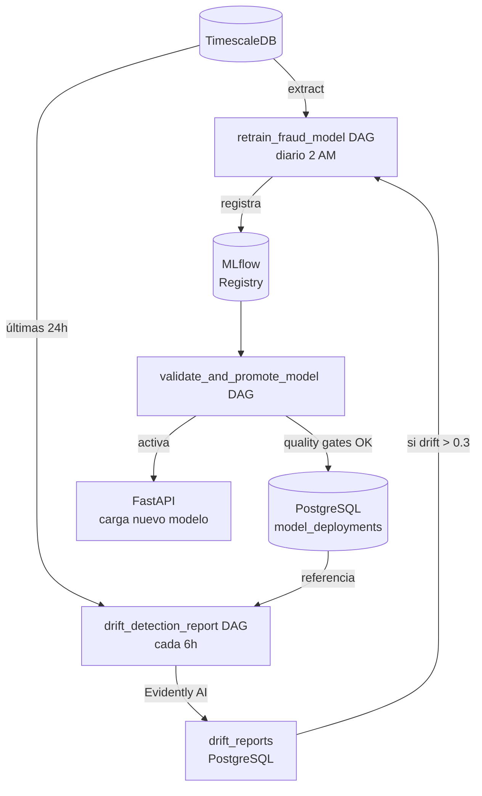
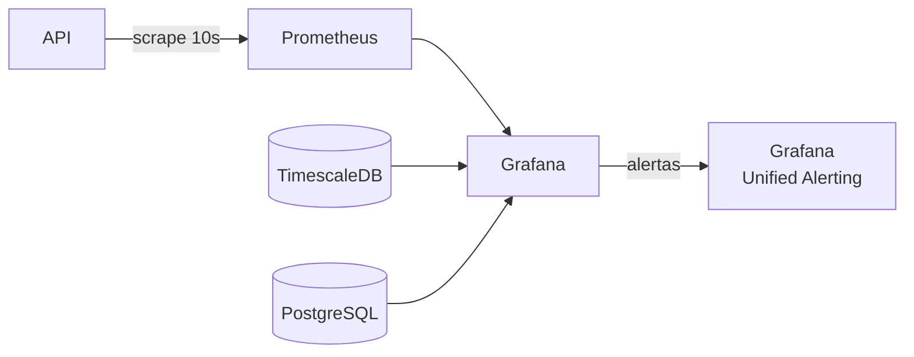

# Arquitectura del Sistema

## Pipeline en tiempo real

```mermaid
flowchart LR
    SIM[Simulador\nProducer] -->|Avro| RAW[transactions.raw]
    RAW --> FE[Feature Engineering\nConsumer]
    FE -->|ventanas 1h/24h/7d| REDIS[(Redis\ncaché estado)]
    FE -->|inserta| TSDB[(TimescaleDB\nhypertable)]
    FE -->|Avro| FEAT[transactions.features]
    FEAT --> IC[Inference\nConsumer]
    IC -->|POST /predict| API[FastAPI\nXGBoost]
    API -->|async| PG[(PostgreSQL\npredicciones)]
    IC -->|Avro| PRED[transactions.predictions]
    IC -->|si fraude| ALERTS[transactions.fraud.alerts]
    API --> METRICS[/metrics\nPrometheus]
```

## Pipeline MLOps (batch)



## Monitoreo


